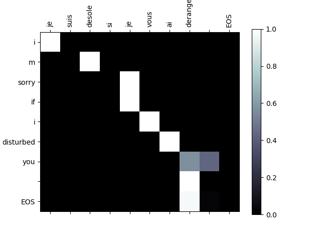

# seq2seq with attention
练习使用**seq2seq with attention model**训练一些简单的数据

## environment
```
python 3.7.3
pytroch-cpu 1.0.1
torchvision-cpu 0.2.2 
visdom 0.1.8.8
tensorboardX 1.7
```
代码已测试环境:Ubuntu 16.04 LTS

##  dataset

[Anki](Anki://apps.ankiweb.net/)

[Tab-delimited Bilingual Sentence Pairs](http://www.manythings.org/anki/)

[download fra-eng.zip](http://www.manythings.org/anki/fra-eng.zip)

## directory
```
.
├── config.py        # 配置文件，训练的一些参数
├── data             # 数据集文件和数据加载类
│   ├── data_loader.py
│   ├── eng-fra.txt
│   └── __init__.py
├── img
├── models           # 模型文件
│   ├── decoder.py
│   ├── encoder.py
│   ├── __init__.py
├── README.md
├── test.py          # 测试文件
├── train.py         # 训练数据
├── _utils           # 工具集
│   ├── __init__.py
│   └── transformer.py
└── weights          # 保存模型参数
```

## demo

### train
1. start visdom service:`python -m visdom.server` execute trian.py:`python train.py `
2. **修改参数** `vi config.py `
3. loss function


4. DecoderRNN with attention网络结构图


### test
1. 如果不需要查看网络结构，则不需要执行这条命令。start tensorboardX service: `tensorboard --logdir runs`, **need tensorflow**, 附:[tensorboardX简单使用教程](https://github.com/tensor-yu/PyTorch_Tutorial)
2. 测试: `python test.py`
3. 较好的测试结果
    * predict sentence
    ```
    fra input sentence: en ce moment je n etudie pas  EOS
    eng output sentence: i am not studying now  EOS
    eng predicted output sentence: i am now not studying  EOS
    ```

    * attention weights
    
    

    * predict sentence
    ```
    fra input sentence: on n est jamais trop vieux pour apprendre  EOS
    eng output sentence: you re never too old to learn  EOS
    eng predicted output sentence: you re never too old to learn  EOS
    ```

    * attention weights
    
    

## 参考文献
[Neural Machine Translation by Jointly Learning to Align and Translate](https://arxiv.org/pdf/1409.0473.pdf)

[translation with sequence to sequence network and attention](https://pytorch.org/tutorials/intermediate/seq2seq_translation_tutorial.html)

[Pytorch模型训练实用教程](https://github.com/tensor-yu/PyTorch_Tutorial)

[tensorboradX](https://github.com/lanpa/tensorboardX)
