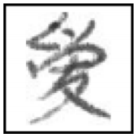

# cnn手写汉字识别

# 环境

```
python 3.7.3
pytroch-cpu 1.0.1
torchvision-cpu 0.2.2 
```

# 主要文件

```
cnn.py     # class of CNN
dataset.py # class of load dataset
train.py   # train the model
```

# 数据集

[HWDB1.1](http://www.nlpr.ia.ac.cn/databases/handwriting/Download.html)


**样例**



**说明**
由于数据集比较大,所以可以自行去官网下载后解压,test数据集解压后放到`./dataset/test/`目录下, train数据集解压后方到`./dataset/train/`目录下.

# 测试
为了避免较大的运算量, 只选择几个汉字进行识别。

**修改测试汉字**
```
vi dataset.py +35
    self.recognize_str = u'心中那自由的世界如此的清澈高原盛开着永不凋零蓝莲花'
vi train.py +23
    recognize_str  = u'心中那自由的世界如此的清澈高原盛开着永不凋零蓝莲花'
vi cnn.py +16
    self.recognize_size = 25
```
**修改参数**
```
vi train.py +16
    EPOCH      = 10
    BATCH_SIZE = 50
    LR         = 0.001
```
 
# 参考文献
[Deep Convolutional Network for Handwritten Chinese Character Recognition](http://yuhao.im/files/Zhang_CNNChar.pdf)

[PyTorch Custom Dataset Examples](https://github.com/utkuozbulak/pytorch-custom-dataset-examples)

[tensorflow手写汉字识别](http://blog.topspeedsnail.com/archives/10897)

