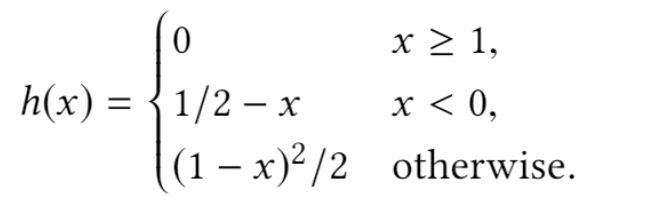
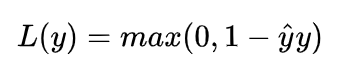
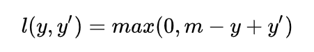

# Smoothed Hinge Loss

## 公式
 \
公式中的``x``为 positive scores - negtive scores

## example

```
from hingeloss import SmoothedHingeLoss
import torch

pos_scores = torch.tensor([0.1, 0.2, 0.4, 0.1])
neg_scores = torch.tensor([0.4, 0.6, 0.2, 0.2])
device = torch.device('cuda' if torch.cuda.is_available() else 'cpu')

hingeloss = SmoothedHingeLoss(device)
loss = hingeloss(pos_scores, neg_scores)
```

# Orgin Hinge Loss

## 公式


## example

```
from hingeloss import OrginHingeLoss
import torch

pos_scores = torch.tensor([0.1, 0.2, 0.4, 0.1])
neg_scores = torch.tensor([0.4, 0.6, 0.2, 0.2])
device = torch.device('cuda' if torch.cuda.is_available() else 'cpu')

hingeloss = SmoothedHingeLoss(device)
loss = hingeloss(pos_scores, neg_scores)
```

# Variant Hinge Loss

## 公式


## example

```
from hingeloss import HingeMarginLoss
import torch

pos_scores = torch.tensor([0.1, 0.2, 0.4, 0.1])
neg_scores = torch.tensor([0.4, 0.6, 0.2, 0.2])
device = torch.device('cuda' if torch.cuda.is_available() else 'cpu')

hingeloss = HingeMarginLoss(device, margin=1.)
loss = hingeloss(pos_scores, neg_scores)
```
