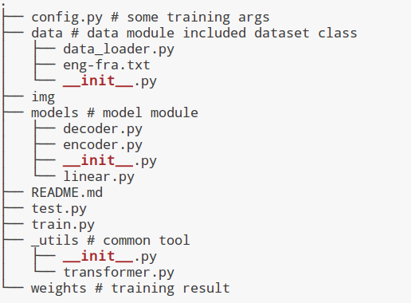
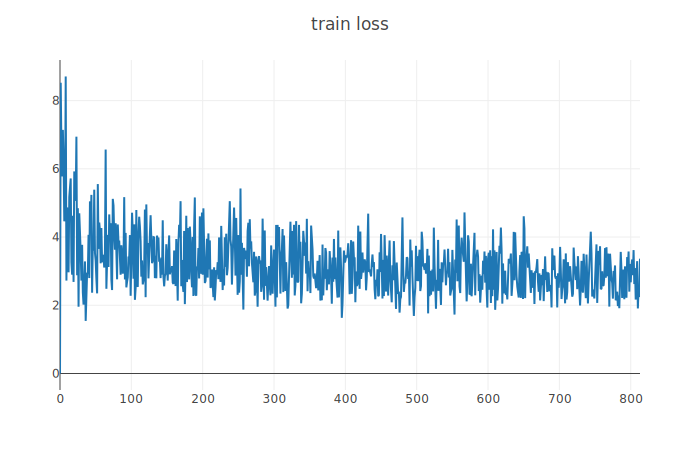

# seq2seq translate
练习使用**seq2seq model**训练一些简单的数据

# 环境
```
python 3.7.3
pytroch-cpu 1.0.1
torchvision-cpu 0.2.2 
visdom 0.1.8.8
```

# dataset
[Anki](Anki://apps.ankiweb.net/)
[Tab-delimited Bilingual Sentence Pairs](http://www.manythings.org/anki/)
[download fra-eng.zip](http://www.manythings.org/anki/fra-eng.zip)

# directory


# demo

## train

1. 启动visdom服务:`python -m visdom.server` 然后执行trian.py文件:`python train.py `

2. **修改参数** `vi config.py `

3. loss function


## test
1. `python test.py`

# 参考代码
[sequence-to-sequence-from-scratch](https://github.com/astorfi/sequence-to-sequence-from-scratch)

# 参考文献
[Sequence to Sequence Learning with Neural Networks](https://papers.nips.cc/paper/5346-sequence-to-sequence-learning-with-neural-networks.pdf)
